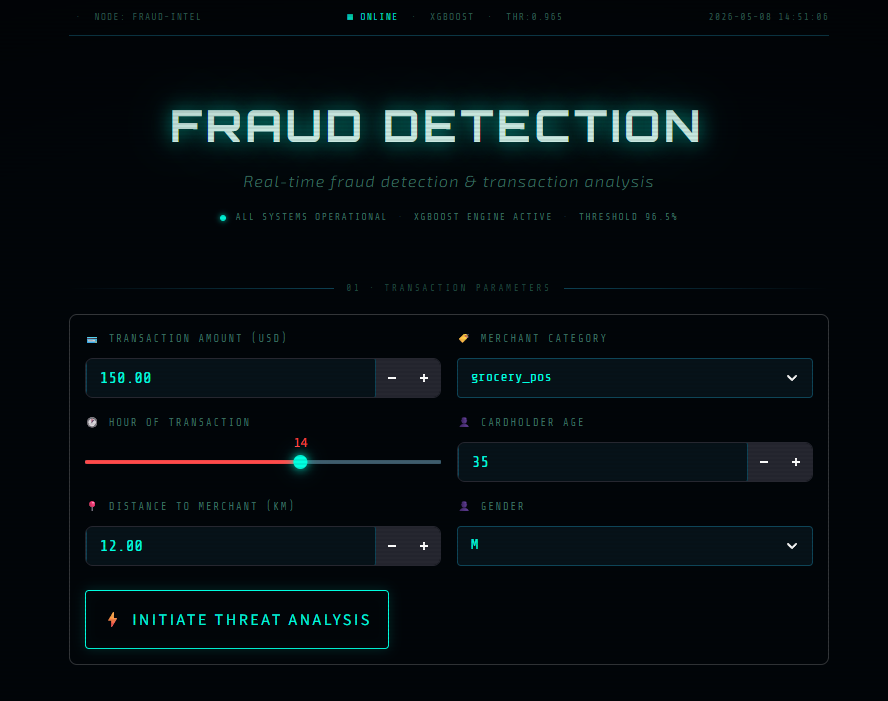
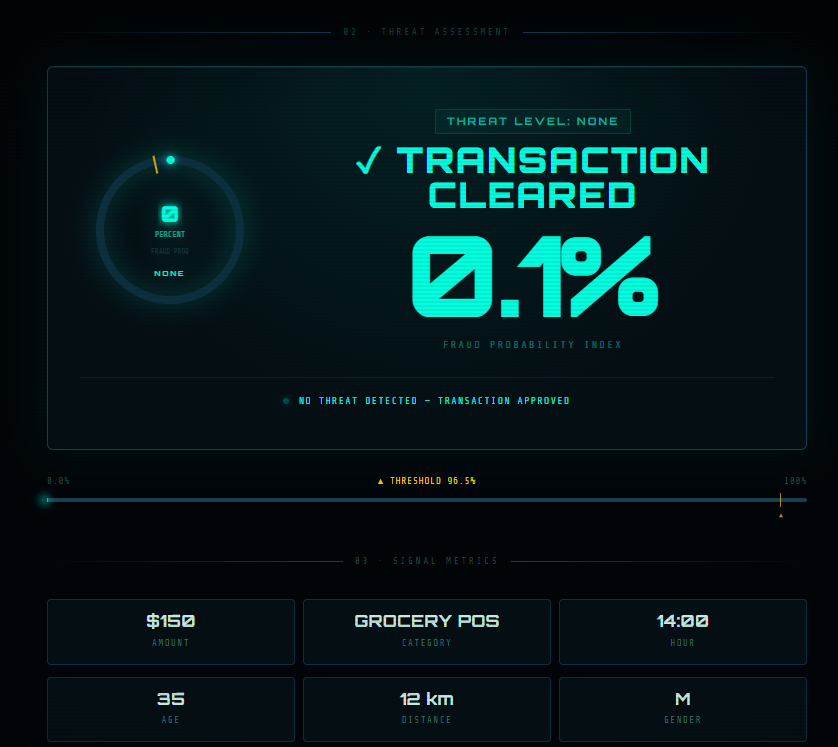
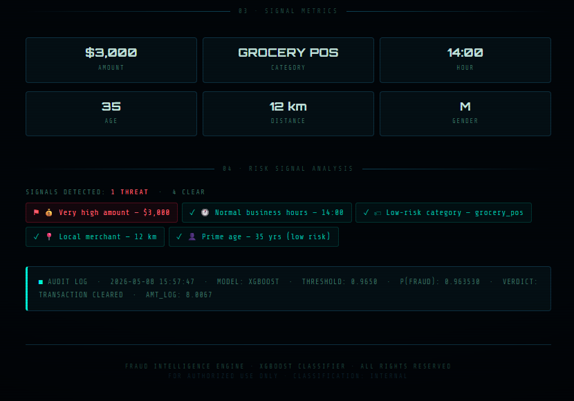

# 💳 Credit Card Fraud Detection


---

## 🚀 Live Demo

🔗 **Open the App:**  
[Credit Card Fraud Detection Streamlit App](https://fraud-detection-mw9qdcgvjmoazcdg2lyeqc.streamlit.app/)

---

## 📌 Overview

This project is an interactive **Credit Card Fraud Detection** web application built with **Machine Learning** and deployed using **Streamlit**.

The app analyzes transaction details and predicts whether the transaction is:

- ✅ **Not Fraud**
- 🚨 **Fraud**

The project focuses on handling imbalanced fraud data using feature engineering, probability prediction, threshold tuning, and suspicious transaction analysis.

---

## 📸 App Screenshots

### 🏠 Transaction Input Interface


### ✅ Fraud Probability Result


### 📊 Risk Signal Analysis


---

## ✨ Key Features

- 🚨 Fraud / Not Fraud prediction
- 📊 Fraud probability score
- ⚖️ Imbalanced data handling
- 🎯 Custom threshold tuning
- 🔎 Suspicious transaction ranking
- 🧠 XGBoost weighted classification model
- 🌐 Interactive Streamlit user interface
- 📈 Risk signal analysis for better decision support

---

## 🧠 Best Model

The best-performing model used in this project is:

```text
XGBoost Weighted Model
```

This model was selected because it performed well with imbalanced data and successfully assigned high fraud probabilities to suspicious transactions.

---

## 🗂️ Dataset

Dataset used:

**Credit Card Transactions Fraud Detection**

Kaggle Dataset:  
https://www.kaggle.com/datasets/kartik2112/fraud-detection

Main files:

```text
fraudTrain.csv
fraudTest.csv
```

Target column:

```text
is_fraud
```

| Value | Meaning |
|---|---|
| 0 | Not Fraud |
| 1 | Fraud |

---

## 🛠️ Technologies Used

- Python
- Pandas
- NumPy
- Matplotlib
- Scikit-learn
- XGBoost
- Imbalanced-learn
- Streamlit
- Kaggle Notebook

---

## ⚙️ How to Run Locally

Clone the repository:

```bash
git clone https://github.com/YOUR_USERNAME/credit-card-fraud-detection.git
cd credit-card-fraud-detection
```

Install the required libraries:

```bash
pip install pandas numpy matplotlib scikit-learn xgboost imbalanced-learn streamlit
```

Run the Streamlit app:

```bash
streamlit run app.py
```

---

## 📈 Project Outputs

The project can generate the following output files:

```text
fraud_detection_model_comparison.csv
fraud_detection_feature_importance.csv
fraud_detection_threshold_comparison.csv
top_suspicious_transactions.csv
```

---

## 🚀 Future Improvements

- Add LightGBM model comparison
- Add SHAP explainability
- Improve the Streamlit UI
- Add batch transaction upload
- Deploy the model as a real-time API
- Add model monitoring and drift detection

---

## 📬 Contact

**Kareem Badr Saber**

- GitHub: https://github.com/kareembadrsaber
- LinkedIn: https://www.linkedin.com/in/kareem-abdelkader-b52550b7/
- Live App: https://fraud-detection-mw9qdcgvjmoazcdg2lyeqc.streamlit.app/

---

## ⭐ Support

If you found this project useful, please consider giving it a ⭐ on GitHub.

---

## ⚠️ Disclaimer

This project is for educational and portfolio purposes only.  
It should not be used as a production fraud detection system without further validation, monitoring, and compliance review.
